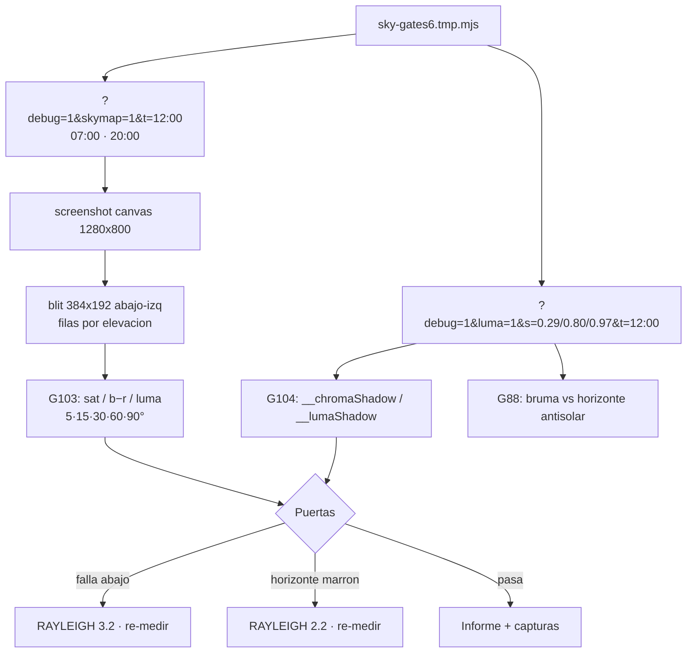

# Fase §6 — Cielo radiante: medición G103/G104 e informe

## Contexto — qué YA está hecho (sesión anterior, sin commit)

| Cambio del brief | Estado | Dónde |
|---|---|---|
| SKY_RAYLEIGH 1.6 → 2.6 (+ comentario actualizado) | ✅ | `src/narrative/choreography.ts:144` |
| HEMI_GRAY_MIX 0.6 → 0.75 (solo tinte) | ✅ | `src/narrative/choreography.ts:153` |
| Rampa `skyViewF = smoothstep(0.02, 0.24, …)` en el dome | ✅ | `src/engine/viewer.ts:257` (§6 comentado) |
| Rampa IDÉNTICA en la capture | ✅ | `src/engine/sky-capture.ts:196` |
| Puerta contrato G103-sky-blue | ✅ | `scripts/verify-3a.ts:2042-2066` |
| Puerta contrato G104-shadow-chroma | ✅ | `scripts/verify-3a.ts:2068-2085` |
| Contrato global (SKY_RAYLEIGH===2.6, HEMI_GRAY_MIX===0.75) | ✅ | `scripts/verify-3a.ts:1100-1101` |
| Instrumento de medición | ⚠️ incompleto | `sky-gates6.tmp.mjs` (raíz): lee zenith + horizontes sol/anti y los encuadres, pero la sección 3 (bandas a elevaciones fijas) es un stub — NO mide las 5 elevaciones de G103 |

**Lo pendiente de esta fase son los NÚMEROS** (las puertas G103/G104 son contrato en Node, medición en prod) **+ el informe.** No se toca ningún parámetro de color salvo que una puerta falle y aplique su regla de decisión (un paso, una medida).

---

## 1. Completar el instrumento de bandas — `sky-gates6.tmp.mjs`

- [ ] **Exponer `__skySunAz` (deg) en viewer.ts** para saber qué columnas excluir (disco solar + halo mie). Dos líneas en el bloque debug existente de `?skymap=1` (`viewer.ts:2660-2672`), usando `skyCap.sunAzimuthDeg()` (ya existe en sky-capture.ts:263). Misma cadencia de 30 frames; cero rastro en prod.
- [ ] **Sección 3 del script: medir bandas del blit** desde `/tmp/sky6-map-*.png` (sharp, ya importado):
  - Geometría conocida: blit equirect **384×192 CSS px** en la esquina inferior-izquierda del canvas 1280×800 (PNG top-down: filas 608–800, columnas 0–384).
  - Fila para cada elevación `el`: `row = 608 + (0.5 − el/180)·192` →
    - **5° → 699 · 15° → 688 · 30° → 672 · 60° → 640 · 90° → 608** (G103 @12:00)
    - **20° → 675** (alba/ocaso)
  - Columnas: excluir **±24 px alrededor de la columna solar** (`__skySunAz` → col = az/360·384, halo mie + disco contaminan la saturación) y **3 columnas junto a cada borde** (costura equirect, clamp).
  - Métricas por banda: **sat HSV = (max−min)/max**, **b−r**, **luma** (0.2126/0.7152/0.0722), sobre sRGB/255.
- [ ] **Correr la batería completa** (el script ya recorre t=12:00/07:00/20:00 + s=0.29/0.80/0.97):
  - `t=12:00`: sat/b−r/luma en las cinco elevaciones → tabla G103.
  - `t=07:00` y `t=20:00`: **RGB crudo a 5° y 20°** (filas 699 y 675) → riesgo alba/ocaso.

## 2. G104 — sombra menos azul (sonda `?luma=1`, ya instrumentada)

- [ ] **`__chromaShadow` / `__lumaShadow`** en `s=0.80` y `s=0.29` @ `t=12:00` (el script ya los lee en `frame()`).
  - Criterio: **croma ≤ 0,28** (hoy 0,473) · **luma ±12 %** del último valor reportado en §5 (si el baseline no está a mano, se reportan los valores nuevos y el usuario juzga).
- [ ] **Coherencia (la que importa):** `croma(pared en sombra) ≤ sat(cielo a 30°) × 1,1` — cruza la banda de 30° de G103 con `__chromaShadow` de G104.

## 3. No-romper (medir y reportar)

- [ ] **Alba/ocaso:** RGB a 5° y 20° @ 07:00/20:00 — ni marrón ni magenta (protege `skySunF` 5°→25°, intacto por contrato G103).
- [ ] **G88:** `__valleyFogDist` / `__valleyTerr` en los encuadres (ya en el script) — la bruma toma el color del mapa de cielo, se mueve por construcción; re-medida y reporte.
- [ ] **G24:** `__zenithHex` @12:00 sigue dentro de su banda `[G24_ZEN_MIN, G24_ZEN_MAX]` — riesgo real de subir Rayleigh (el zenith se ilumina).
- [ ] **G19/G9:** no deberían moverse — verify estático; si algo se mueve, algo más cambió.

## 4. Verificación y capturas

- [ ] **`npx tsx scripts/verify-3a.ts`** — pasada completa (G103/G104 contrato + contrato global + G31 + resto). Lint solo si se edita viewer.ts (`npx oxlint src/engine/viewer.ts`).
- [ ] **Capturas** (las produce el script): `/tmp/sky6-frame-s029-1200.png` · `/tmp/sky6-frame-s080-1200.png` · `/tmp/sky6-frame-actoV-1200.png` (s=0.97, mismo plano Acto V).

## 5. Informe (tabla + capturas) y reglas de decisión

- [ ] **Tabla G103 @12:00:** sat/b−r/luma en 5°/15°/30°/60°/90° + la **relación 15°/60°** (= rampa; el nivel absoluto = Rayleigh, quedan separados).
- [ ] **Informe G104:** croma/luma en ambos `s` + condición de coherencia.
- [ ] **Reglas del brief (una a una, nunca dos palancas a la vez):**
  - G103 falla por abajo → `SKY_RAYLEIGH` 2.6 → **3.2**, re-medir.
  - Horizonte se va a marrón/magenta → `SKY_RAYLEIGH` → **2.2**, re-medir.
  - G104 falla → **reportar** (paredes a azul hielo sería decisión de fase, no se toca ya).
  - Si el luma de sombra baja → **NO** compensar con `HEMI_LUMA_FLOOR` (intacto): reportar y calcular aparte.
- [ ] **Criterio visual manda:** s=0.29, s=0.80 @12:00 y Acto V deben leerse como día claro de montaña (azul con cuerpo arriba, pálido junto a las crestas, nubes recortadas). Si los números pasan y sigue gris, no está hecho.

## Notas

- **Sin commit** — el usuario sube.
- `sky-gates6.tmp.mjs` es scratch de medición (raíz, no versionado); los cambios reales del proyecto en esta fase son como mucho las 2 líneas de `__skySunAz` en el bloque debug.
- NO TOCAR: nubes, SKY_SAT (2.0), SKY_SCALE, HEMI_LUMA_FLOOR, SHADOW_INTENSITY, turbidez (1.7).

